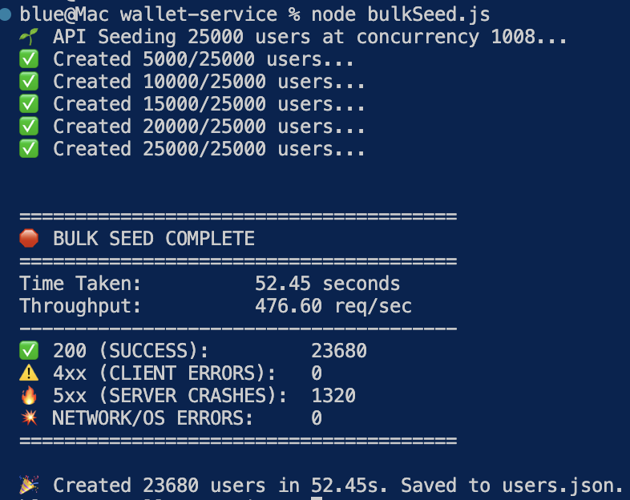
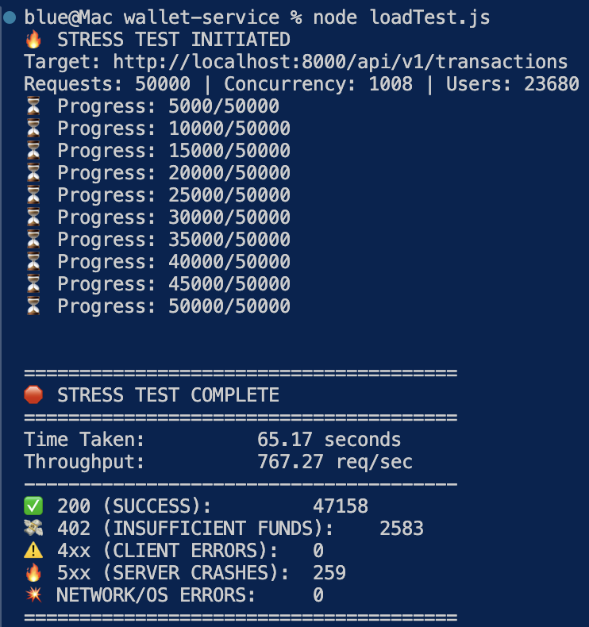
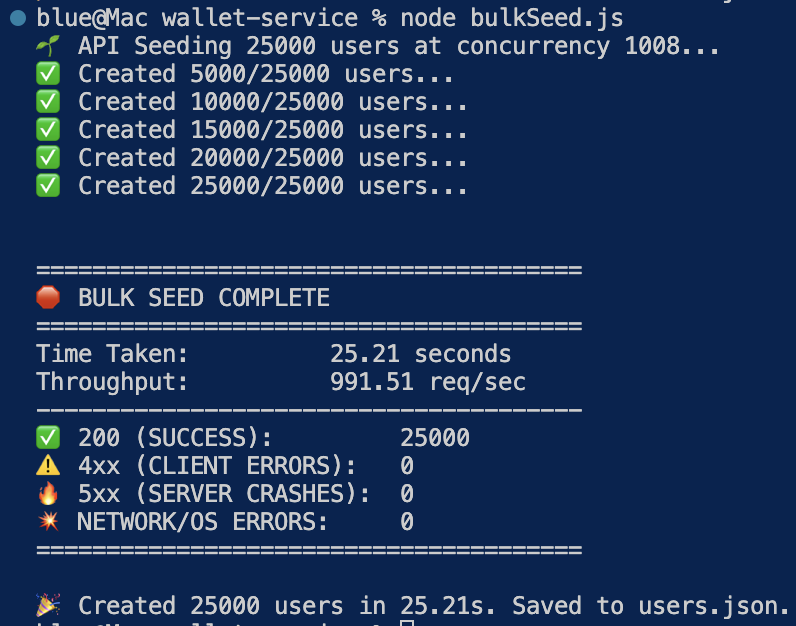
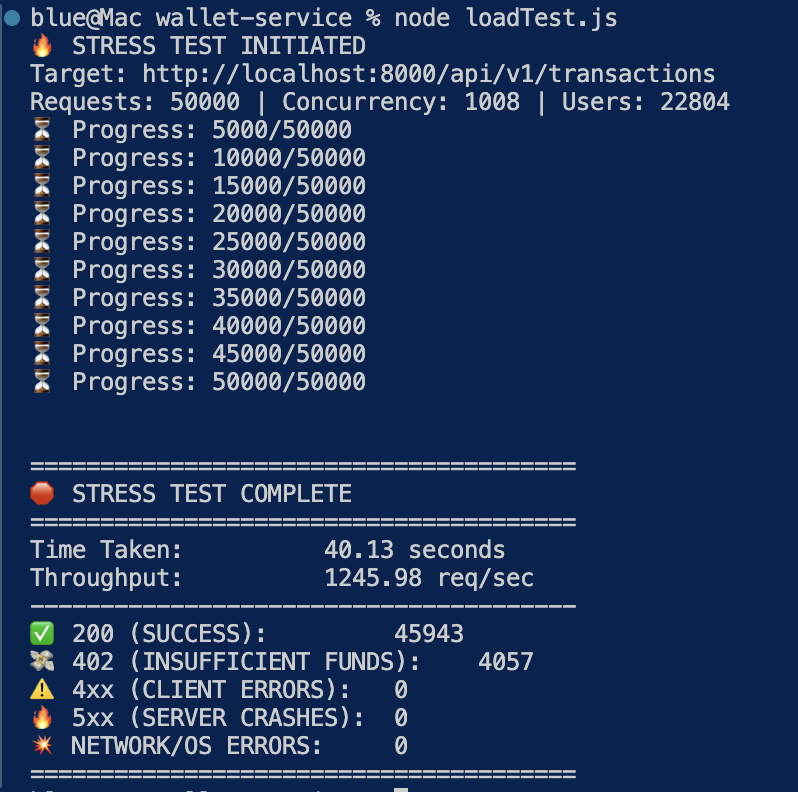

# Wallet Service

A high-concurrency, closed-loop internal wallet microservice. Engineered with a Double-Entry Ledger system, ACID-compliant transactions, and strict deadlock avoidance.

## Table of Contents

- [Wallet Service](#wallet-service)
  - [Table of Contents](#table-of-contents)
  - [Live Demo](#live-demo)
  - [Quick Start (Docker)](#quick-start-docker)
  - [Architecture](#architecture)
    - [1. Handling Concurrency \& Race Conditions (transactions.service.ts)](#1-handling-concurrency--race-conditions-transactionsservicets)
    - [2. Idempotency](#2-idempotency)
    - [3. Double-Entry Ledger (Auditability)](#3-double-entry-ledger-auditability)
    - [4. Cursor-based Pagination](#4-cursor-based-pagination)
    - [5. Observability](#5-observability)
  - [Choice of Technology](#choice-of-technology)
  - [Bottlenecks](#bottlenecks)
    - [1. The I/O Bottleneck: External API Calls (Pending)](#1-the-io-bottleneck-external-api-calls-pending)
    - [2. The Database Bottleneck: System Wallet Hot-Row Contention (Resolved ✅)](#2-the-database-bottleneck-system-wallet-hot-row-contention-resolved-)
  - [API Reference](#api-reference)
    - [1. Transactions](#1-transactions)
    - [2. User Management](#2-user-management)
    - [3. Analytics \& History (Cursor Pagination)](#3-analytics--history-cursor-pagination)
  - [Upcoming Changes (WIP, Post-Submission)](#upcoming-changes-wip-post-submission)
  - [Benchmarks](#benchmarks)
    - [Phase 1: Pre-Optimization (Strict Locking)](#phase-1-pre-optimization-strict-locking)
      - [Pre-Optimization Bulk Seed Test](#pre-optimization-bulk-seed-test)
      - [Pre-Optimization Load Test](#pre-optimization-load-test)
    - [Phase 2: Post-Optimization (Eventual Consistency \& Background Worker)](#phase-2-post-optimization-eventual-consistency--background-worker)
      - [Post-Optimization Bulk Seed Test](#post-optimization-bulk-seed-test)
      - [Post-Optimization Load Test](#post-optimization-load-test)
    - [Running the Benchmarks](#running-the-benchmarks)

## Live Demo

**Base URL:** `https://wallet-service-h0le.onrender.com/api/v1`
_(Note: Hosted on Render Free Tier. The first request may take well over 1 minute to wake the server from sleep)._

## Quick Start (Docker)

The application is fully containerized. No manual database setup is required.

1. Clone the repository and setup the environment:
   ```bash
   cp .env.example .env
   ```
2. Spin up the cluster:
   ```bash
   docker-compose up --build -d
   ```

- The PostgreSQL container will boot and automatically run `sql/setup.sql`.
- This provisions the entire schema, Enums, constraints, and seeds the database with `SYSTEM` wallets and two initial users (`Blue` & `Soap`).
- The Node.js application will wait for the DB to be healthy and then bind to `http://localhost:8000`.
- **pgAdmin** is available at `http://localhost:5050` (Login: `admin@admin.com` / `admin`). You MUST create a server once you log in and pass in database name, password, and user as set in .env file.

_(Note: A Postman Collection will be included in the repo root for easy endpoint testing)._

---

## Architecture

### 1. Handling Concurrency & Race Conditions ([transactions.service.ts](./src/services/transactions.service.ts))

- **Pessimistic Locking:** All transactions use PostgreSQL row-level locks (`SELECT ... FOR UPDATE`). If a user clicks "Buy" twice immediately, the database serializes the requests, forcing the second request to wait until the first is committed.
- **Deadlock Avoidance:** Locks are acquired in a strictly deterministic order. The `SYSTEM` wallet is always locked before the `USER` wallet. This prevents circular wait conditions when multiple users transact simultaneously.

### 2. Idempotency

Every `POST /transactions` request requires a UUID `idempotency-key` header.

- If a duplicate key is detected, the transaction is intercepted before acquiring locks.
- If the previous attempt failed, the exact failure reason is re-thrown.
- If successful, the previous success response is returned.

### 3. Double-Entry Ledger (Auditability)

A user's `balance` in the `wallets` table is effectively a high-speed cache. The true source of truth is the `ledger`.
Every transaction creates at least two rows in the `ledger` table:

- For example, a `SPEND` of 100 CP creates a `DEBIT (-100)` for the User wallet, and a `CREDIT (+100)` for the System Revenue wallet.
- The sum of any transaction across the ledger is always exactly `0`.

### 4. Cursor-based Pagination

`OFFSET` pagination degrades significantly as tables grow to millions of rows.
I have implemented a **Cursor-based Pagination** using Tuple Comparisons `(created_at, id) < (cursor_time, cursor_id)`. Combined with Composite Indexes (`idx_transactions_cursor`), this ensures FAST query times regardless of how deep the user scrolls into their history.

### 5. Observability

- Used `pino` for high-performance, structured JSON logging.
- Every request is assigned a unique `requestId` (UUID) via middleware. This ID is passed to child loggers in the Service layer, allowing full correlation of logs from Controller to Service.
- `pino-http` is used to automatically log request start, completion, latency, and response codes.
- To aid fraud detection and support, every transaction captures rich metadata like IP Address, Location, User Agent, and pre-request balance snapshots.

---

## Choice of Technology

- **Runtime:** Currently, I only know `Node.js` + `TypeScript`, and `FastAPI` + `Python`. Both runtimes have support for asyncio which is ideal for high-throughput, IO-bound tasks (like waiting for database locks). So the decision comes down to the choice of language. I believe for a financial system such as this, type-safety is a MUST and hence, I chose TS over Python. Yes, Python does have Pydantic but Python is not compiled. This is a TS advantage because most of the issues can be weeded out at compile-time rather than having to wait for runtime.
- **Database:** `PostgreSQL`. Chosen for its unmatched ACID compliance, robust locking mechanisms, and advanced JSON aggregation capabilities.
- **Validation:** `Zod`. Financial inputs require strict checking and validation. Zod handles runtime type-checking and coercion (especially crucial for `BigInt` string parsing).
- **Database Driver:** `pg` (Raw SQL). ORMs abstract away critical performance tuning. Using raw SQL allows for optimal Common Table Expressions (CTEs), explicit `FOR UPDATE` clauses, and complex `json_build_object` joins to prevent N+1 query problems. (Also, I wanted to work with raw SQL for a while now.)

---

## Bottlenecks

While this architecture is robust, there are two distinct bottlenecks that would need addressing for production at scale:

### 1. The I/O Bottleneck: External API Calls (Pending)

Currently, the `/users` and `/transactions` routes rely on an external call to `ip-api.com` to fetch geolocation metadata.

- This is the BIGGEST bottleneck. Making an external HTTP request takes 50-500ms, and this is a bottleneck for every request.
-
- A possible fix would be to replace the network call with a self-hosted, in-memory IP database.

### 2. The Database Bottleneck: System Wallet Hot-Row Contention (Resolved ✅)

- Currently we are locking BOTH system wallet and user wallet. This works at smaller scale. However, at a scale of tens of thousands of users, this is a bottleneck.

- Suppose we have about 10,000 users performing a transaction of same type (requiring the same system wallet), this would result in a massive transaction queueing.

- A possible fix would be to lazy update the system wallet, i.e., not lock and update the system wallet at all. We simply lock the user wallet and update it. And to update the system wallet, we can run a background worker that runs every 60 seconds and aggregates the system ledger entries and updates the System Wallet balance.

## API Reference

### 1. Transactions

**`POST /transactions`**
Executes a financial transaction. Requires strictly typed inputs and idempotency.

- **Headers:**
  - `idempotency-key` (Required): A unique `UUIDv4` string.
- **Body:**
  ```json
  {
    "userId": "uuid...",
    "transactionType": "PENALTY", // TOPUP, SPEND, BONUS, REWARD, PENALTY
    "assetType": "CREDITS", // CP, CREDITS
    "amount": "100", // String (parsed to BigInt)
    "description": "Friendly fire."
  }
  ```

### 2. User Management

**`POST /users`**
Registers a new user and provisions their CP and CREDITS wallets. Also creates a transaction for sign-up bonus (250 CREDITS.)

- **Body:**
  ```json
  {
    "username": "Ghost",
    "email": "ghost@mw2.com"
  }
  ```

**`GET /users/balance/:userId`**
Fetches the current wallet balances for a specific user.

### 3. Analytics & History (Cursor Pagination)

**`GET /users/balance`**
Retrieves a leaderboard/list of user balances in DESCENDING order.

- **Query Params:**
  - `currency`: `CP` or `CREDITS` (Required)
  - `limit`: Number of rows
  - `lastWalletId`: UUID cursor from previous page. (Not passed in first request.)
  - `lastBalance`: Balance cursor from previous page. (Not passed in first request.)

**`GET /users/:userId/transactions`**
Retrieves the full transaction history with audit trails.

- **Query Params:**
  - `limit`: Number of rows
  - `lastTransactionId`: UUID cursor from previous page. (Not passed in first request.)
  - `lastTimestamp`: ISO Date cursor from previous page. (Not passed in first request.)

## Upcoming Changes (WIP, Post-Submission)

I really loved working on this project, a huge thanks to the Dino Ventures team!
Here's a list of upcoming changes:

- [x] I will stress test this app and share the script + results.
- [x] Implement lazy update optimization as mentioned in previous section.
- [ ] Postman collection for the API.
- [ ] Vibe code a frontend for better UX.

## Benchmarks

> [!WARNING]
> Do NOT run these load-testing scripts against the live Render URL. The free-tier server will crash. These scripts are designed for local stress testing against the Dockerized PostgreSQL instance.

I wrote two custom scripts:

1. **[bulkSeed.js](./bulkSeed.js)**: Registers 25,000 users (each registration triggers a Bonus Transaction).
2. **[loadTest.js](./loadTest.js)**: Fires 50,000 transactions across random users.

**Test Environment:** MacBook Air (M2, 8GB RAM) | DB Pool Size: `95` | Concurrency: `1008`

### Phase 1: Pre-Optimization (Strict Locking)

_Architecture: Locked both `SYSTEM` and `USER` wallets in real-time._

| Test          | Total Requests | Time Taken | Throughput     | 200 (Success) | 5xx (Server Crashes) |
| :------------ | :------------- | :--------- | :------------- | :------------ | :------------------- |
| **Bulk Seed** | 25,000         | 52.45s     | 476.60 req/sec | 23,680        | **1,320**            |
| **Load Test** | 50,000         | 65.17s     | 767.27 req/sec | 47,158        | **259**              |

**Insight:** The system crashed repeatedly under load. Because 1,008 concurrent requests were fighting over the 95 available database connections to lock the **exact same System row**, the DB connection pool exhausted itself. Requests sat in the Node queue until they timed out, throwing 500 errors.

#### Pre-Optimization Bulk Seed Test



#### Pre-Optimization Load Test



### Phase 2: Post-Optimization (Eventual Consistency & Background Worker)

_Architecture: Locked ONLY the `USER` wallet. `SYSTEM` wallet updated asynchronously via [background worker](./src/core/scheduler.ts)._

| Test          | Total Requests | Time Taken | Throughput          | 200 (Success) | 5xx (Server Crashes) |
| :------------ | :------------- | :--------- | :------------------ | :------------ | :------------------- |
| **Bulk Seed** | 25,000         | 25.21s     | **991.51 req/sec**  | 25,000        | **0**                |
| **Load Test** | 50,000         | 41.66s     | **1245.98 req/sec** | 45,943\*      | **0**                |

> \*_Note: The remaining 4,057 requests correctly returned `402 Insufficient Funds` as users ran out of starting credits. Zero double-spends occurred._

**Insight:** By removing the System lock, database connections were freed up instantly. The 95 active DB connections were able to lock 95 _different_ User wallets simultaneously.
**Throughput increased by over 56%, and server crashes dropped to 0.** The architecture is now strictly ACID at the user level, and Eventually Consistent at the system level.

#### Post-Optimization Bulk Seed Test



#### Post-Optimization Load Test



### Running the Benchmarks

To run the full stress-test yourself, ensure the app is running (see [Quick Start (Docker)](#quick-start-docker)) and execute the following command:

```bash
npm run test:benchmark
```

**What this does:**

1. Executes [bulkSeed.js](./bulkSeed.js) script to register 25,000 users (and generates `users.json`).
2. Then executes the [loadTest.js](./loadTest.js) script to run 50,000 concurrent transactions against those users.

**Configuration Notes:**

- You can tweak the database connection pool size by changing `MAX_POOL_SIZE` in the `.env` file.
- _Note:_ PostgreSQL default `max_connections` is 100 (with ~3 reserved for superusers).
